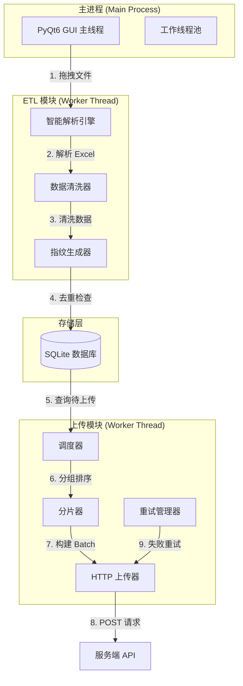

# 技术方案设计文档 (TDD) - Dianping Data ETL & Uploader

| 文档版本 | 修改日期 | 修改人 | 备注 |
| :--- | :--- | :--- | :--- |
| V2.0 | 2026-01-23 | Technical Director | 基于 PRD V1.3 重构，单机应用架构 |

---

## 1. 技术选型 (Tech Stack)

### 1.1 架构模式
采用**单机桌面应用**架构，所有逻辑在客户端本地执行，无需服务端部署。

### 1.2 核心技术栈

#### 1.2.1 开发语言与运行时
*   **Language**: **Python 3.10+**
    *   *理由*：丰富的 Excel 处理库生态，跨平台支持良好，开发效率高。

#### 1.2.2 GUI 框架
*   **Primary**: **PyQt6** (推荐)
    *   *理由*：原生体验好，跨平台一致性强，支持现代 UI 效果。
*   **Alternative**: **Tkinter + ttkbootstrap** (备选)
    *   *理由*：Python 内置，无需额外安装，配合 ttkbootstrap 可美化界面。

#### 1.2.3 数据处理库
*   **Excel 解析**: **openpyxl** 或 **pandas.read_excel**
    *   *理由*：支持 `.xlsx` 格式，可精确控制单元格读取类型。
*   **数据清洗**: **pandas** (DataFrame 操作)
    *   *理由*：高效的数据处理与转换能力。

#### 1.2.4 数据存储
*   **Database**: **SQLite3** (Python 内置 `sqlite3` 模块)
    *   *理由*：轻量级，无需额外服务，适合单机应用。

#### 1.2.5 网络请求
*   **HTTP Client**: **requests**
    *   *理由*：简单易用，支持重试与超时配置。

---

## 2. 系统架构 (System Architecture)

采用**单进程多线程**架构，主线程负责 UI 渲染，工作线程处理 ETL 与上传任务。



---

## 3. 核心模块详细设计

### 3.1 智能解析引擎 (Parser Engine)

#### 3.1.1 文件读取策略
*   **库选择**：使用 `openpyxl` 的 `load_workbook`，设置 `data_only=True` 获取计算后的值。
*   **表头识别**：
    *   扫描前 20 行，匹配关键列名（如 `交易流水号`、`订单明细表`、`营业日期` 等）。
    *   表头行号配置化（见 PRD 第 5 节），支持动态调整。

#### 3.1.2 有效数据范围
*   **起始行**：Header 行的下一行。
*   **结束行**：遇到“合计/总计”行或连续 3 个空行时停止。

#### 3.1.3 数据类型强制转换
*   **全文本策略**：使用 `openpyxl` 时，通过 `cell.value` 获取原始值，然后统一转换为 `str`。
*   **关键实现**：
    ```python
    def normalize_cell_value(cell):
        """强制转换为字符串，区分空值与零值"""
        if cell.value is None:
            return ""  # 空值 -> 空字符串
        str_val = str(cell.value).strip()
        if str_val == "":
            return ""  # 空白 -> 空字符串
        # '0', '0.00' 等零值保留为字符串
        return str_val
    ```

### 3.2 严格清洗策略 (Strict Cleaner)

#### 3.2.1 空值与零值区分 (CRITICAL)
*   **零值场景**：单元格显式为 `0`、`0.00` 或文本 `"0"`。
    *   **处理**：保留为字符串 `"0"` 或 `"0.00"`。
*   **空值场景**：单元格为 `None`、`""` 或空白。
    *   **处理**：统一转换为空字符串 `""`。
*   **严禁操作**：禁止使用 `if not value: value = 0` 等逻辑，禁止将空值默认填补为 0。

#### 3.2.2 日期清洗
*   **检测规则**：列名包含 `time` / `date` / `日期` / `时间`。
*   **转换逻辑**：
    ```python
    def convert_excel_date(value, column_name):
        """Excel 日期转换"""
        if not is_date_column(column_name):
            return value
        
        # 场景 1: Excel Serial Date (数字)
        if isinstance(value, (int, float)):
            # Excel 日期从 1900-01-01 开始，需减去 2 天（Excel 1900 年 bug）
            base_date = datetime(1899, 12, 30)
            delta = timedelta(days=value)
            return (base_date + delta).strftime("%Y-%m-%d %H:%M:%S")
        
        # 场景 2: 字符串日期
        if isinstance(value, str):
            # 尝试解析常见格式
            for fmt in ["%Y-%m-%d", "%Y/%m/%d", "%Y-%m-%d %H:%M:%S"]:
                try:
                    dt = datetime.strptime(value, fmt)
                    return dt.strftime("%Y-%m-%d %H:%M:%S")
                except:
                    continue
            # 解析失败，记录警告但保留原值
            logger.warning(f"无法解析日期: {value}")
            return value
        
        return value
    ```

### 3.3 业务主键去重 (Business Key Deduplication)

#### 3.3.1 指纹生成策略
根据 PRD 第 5 节，不同表类型采用不同的主键策略：

*   **明细类表**：直接使用业务唯一 ID。
    *   《会员交易明细》：`交易流水号`
    *   《店内订单明细》：`订单明细表` (第一列 ID)
*   **统计类表**：使用维度组合键 (MD5)。
    *   《收入优惠统计》：`MD5(门店 + 营业日期 + 结账方式 + 编码 + 类型)`
    *   《优惠券统计表》：`MD5(交易日期 + 门店 + 券名称 + 券类型 + 发券数量)`
*   **兜底策略**：若无法提取上述键，退化为全行 MD5。

#### 3.3.2 实现示例
```python
def generate_fingerprint(row_data, file_type):
    """生成业务指纹"""
    if file_type == "会员交易明细":
        return row_data.get("交易流水号", "")
    elif file_type == "店内订单明细":
        # 第一列通常是 ID
        first_col_key = list(row_data.keys())[0]
        return row_data.get(first_col_key, "")
    elif file_type == "收入优惠统计":
        key_parts = [
            row_data.get("门店", ""),
            row_data.get("营业日期", ""),
            row_data.get("结账方式", ""),
            row_data.get("编码", ""),
            row_data.get("类型", "")
        ]
        return hashlib.md5("|".join(key_parts).encode()).hexdigest()
    # ... 其他表类型
    else:
        # 兜底：全行 MD5
        row_str = json.dumps(row_data, sort_keys=True)
        return hashlib.md5(row_str.encode()).hexdigest()
```

### 3.4 存储与去重 (Storage & Deduplication)

#### 3.4.1 数据库设计
```sql
CREATE TABLE upload_tasks (
    id INTEGER PRIMARY KEY AUTOINCREMENT,
    fingerprint VARCHAR(64) NOT NULL UNIQUE,  -- 业务主键，唯一索引
    file_type VARCHAR(32) NOT NULL,
    store_name VARCHAR(128) NOT NULL,
    raw_data TEXT NOT NULL,                   -- JSON 字符串
    timestamp TEXT,                           -- 用于排序的时间字段
    status VARCHAR(20) DEFAULT 'PENDING',    -- PENDING, SUCCESS, SKIPPED, FAILED
    created_at TIMESTAMP DEFAULT CURRENT_TIMESTAMP,
    updated_at TIMESTAMP DEFAULT CURRENT_TIMESTAMP
);

CREATE INDEX idx_fingerprint ON upload_tasks(fingerprint);
CREATE INDEX idx_status ON upload_tasks(status);
CREATE INDEX idx_store_name ON upload_tasks(store_name);
```

#### 3.4.2 去重逻辑
```python
def insert_or_skip(row_data, fingerprint, file_type, store_name, timestamp):
    """插入数据，如果指纹已存在则跳过"""
    conn = get_db_connection()
    cursor = conn.cursor()
    
    try:
        cursor.execute(
            "INSERT INTO upload_tasks (fingerprint, file_type, store_name, raw_data, timestamp, status) "
            "VALUES (?, ?, ?, ?, ?, 'PENDING')",
            (fingerprint, file_type, store_name, json.dumps(row_data), timestamp)
        )
        conn.commit()
        return True  # 插入成功
    except sqlite3.IntegrityError:
        # 指纹已存在，跳过
        return False  # 跳过
    finally:
        conn.close()
```

### 3.5 传输调度 (Transmission Scheduler)

#### 3.5.1 分组与排序
*   **一级分组**：按 `store_name` (门店名称) 分组。
*   **二级排序**：每组内按 `timestamp` ASC 排序。

#### 3.5.2 分片上传
*   **Batch Size**: 100 条/包。
*   **Payload 结构**：
    ```json
    {
      "platformKey": "f5edd587da...",
      "storeId": "MD00001",  // 可选
      "storeName": "山禾田·日料小屋（龙华店）",  // 必填
      "data": [
        { ... },  // 100 条数据
        ...
      ]
    }
    ```

#### 3.5.3 容错机制 (Resilience)

**重试策略**：
*   Batch 失败 -> 等待 `2s` -> 重试 1 -> `5s` -> 重试 2 -> `10s` -> 重试 3。
*   使用指数退避：`wait_time = 2 * (2 ** retry_count)` 秒。

**失败跳过 (Skip)**：
*   3 次重试均失败后，标记该 Batch 为 `SKIPPED`，记录错误日志。
*   **立即执行下一个 Batch**，不阻塞队列。

**连续熔断 (Circuit Breaker)**：
*   检测连续 5 个 Batch 状态均为 `SKIPPED`/`FAILED`。
*   触发熔断：暂停该门店的所有后续任务，UI 弹窗报警。
*   提供“重置任务”按钮，清除熔断状态。

**实现示例**：
```python
class CircuitBreaker:
    def __init__(self, threshold=5):
        self.failure_count = {}  # {store_name: count}
        self.threshold = threshold
        self.circuit_open = set()  # 已熔断的门店
    
    def record_failure(self, store_name):
        self.failure_count[store_name] = self.failure_count.get(store_name, 0) + 1
        if self.failure_count[store_name] >= self.threshold:
            self.circuit_open.add(store_name)
            logger.error(f"熔断触发: {store_name}")
            return True  # 已熔断
        return False
    
    def record_success(self, store_name):
        # 成功时重置计数
        self.failure_count[store_name] = 0
        self.circuit_open.discard(store_name)
    
    def is_open(self, store_name):
        return store_name in self.circuit_open
```

---

## 4. UI/UX 交互实现细节

### 4.1 窗口与样式

#### 4.1.1 窗口配置 (PyQt6)
```python
class MainWindow(QMainWindow):
    def __init__(self):
        super().__init__()
        self.setWindowTitle("Dianping ETL Uploader")
        self.setFixedSize(400, 600)  # 固定尺寸，禁止拉伸
        self.setStyleSheet("""
            QMainWindow {
                background-color: #f5f5f5;
            }
            QPushButton {
                background-color: #FF6633;  /* 点评橙 */
                color: white;
                border-radius: 4px;
                padding: 8px;
            }
            QProgressBar {
                border: 1px solid #ddd;
                border-radius: 4px;
                text-align: center;
            }
            QProgressBar::chunk {
                background-color: #FF6633;
            }
        """)
```

#### 4.1.2 拖拽区域
*   使用 `QWidget.setAcceptDrops(True)` 启用拖拽。
*   监听 `dragEnterEvent` 和 `dropEvent` 事件。
*   支持多文件拖拽。

### 4.2 实时反馈

#### 4.2.1 进度更新
*   **IPC 节流**：每处理 100 条或每 500ms 更新一次 UI。
*   **信号槽机制**：工作线程通过 `QThread` 的 `signal` 发送进度事件到主线程。

#### 4.2.2 日志显示
*   使用 `QTextEdit` 或 `QPlainTextEdit` 显示日志。
*   支持不同级别的颜色标记（INFO: 黑色，ERROR: 红色，SUCCESS: 绿色）。
*   自动滚动到最新日志。

### 4.3 防冻结机制

*   **多线程架构**：
    *   主线程：UI 渲染与事件处理。
    *   工作线程：ETL 处理与 HTTP 上传。
*   **使用 `QThread`**：
    ```python
    class ETLWorker(QThread):
        progress = pyqtSignal(int, int, str)  # current, total, message
        
        def run(self):
            # ETL 逻辑
            for i, row in enumerate(rows):
                # 处理数据
                self.progress.emit(i, len(rows), f"处理中: {i}/{len(rows)}")
    ```

---

## 5. 接口规范 (API Specification)

### 5.1 上传接口
*   **Endpoint**: `POST /api/v1/upload`
*   **Content-Type**: `application/json`
*   **Request Body**:
    ```json
    {
      "platformKey": "f5edd587da...",
      "storeId": "MD00001",  // 可选
      "storeName": "山禾田·日料小屋（龙华店）",  // 必填
      "data": [
        {
          "交易流水号": "xxx",
          "交易时间": "2026-01-23 10:00:00",
          ...
        },
        ...
      ]
    }
    ```
*   **Response**:
    ```json
    {
      "code": 0,
      "message": "success",
      "data": {
        "processed": 100,
        "skipped": 0
      }
    }
    ```

### 5.2 错误处理
*   **HTTP 200 但 code != 0**：业务错误，记录日志，标记为 `SKIPPED`。
*   **HTTP 非 200**：网络错误，进入重试流程。
*   **超时**：默认 30s，进入重试流程。

---

## 6. 开发计划 (Development Plan)

### Phase 1: 核心 ETL 模块
*   实现 Excel 解析引擎（`parser.py`）。
*   实现数据清洗器（`cleaner.py`）。
*   实现指纹生成器（`fingerprint.py`）。
*   单元测试覆盖：空值/零值区分、日期转换、指纹生成。

### Phase 2: 存储与去重
*   设计 SQLite 数据库 schema。
*   实现去重逻辑（`storage.py`）。
*   测试数据插入与查询性能。

### Phase 3: 上传调度
*   实现分片器（`batcher.py`）。
*   实现重试管理器（`retry_manager.py`）。
*   实现熔断器（`circuit_breaker.py`）。
*   集成 HTTP 上传（`uploader.py`）。

### Phase 4: UI 开发
*   搭建 PyQt6 主窗口。
*   实现拖拽功能。
*   实现进度显示与日志输出。
*   实现多线程通信。

### Phase 5: 集成测试
*   端到端测试：文件解析 -> 去重 -> 上传。
*   容错测试：网络中断、服务端错误、大文件处理。
*   性能测试：10万行数据处理时间。

---

## 7. 关键技术难点与解决方案

### 7.1 Excel 日期陷阱
*   **问题**：Excel 日期可能是序列号（如 `45231.5`）或字符串。
*   **解决**：实现统一的日期转换函数，支持多种格式解析（见 3.2.2）。

### 7.2 业务主键提取
*   **问题**：表头行号可能因 Excel 格式变化而偏移。
*   **解决**：将表头行号配置化，支持动态调整（见 PRD 第 5 节）。

### 7.3 文件占用
*   **问题**：Windows 下 Excel 打开文件时，Python 无法读取。
*   **解决**：捕获 `PermissionError`，友好提示用户关闭 Excel。

### 7.4 内存优化
*   **问题**：超大 Excel 文件（>10万行）可能导致内存溢出。
*   **解决**：使用 `openpyxl` 的 `read_only=True` 模式，逐行处理。

---

## 8. 待确认问题 (Q&A for PM)

1.  **关于 API Key**：`platformKey` 是硬编码在客户端里，还是用户登录/配置时输入？（当前方案假设为配置文件或环境变量）。
2.  **关于优惠券指纹**："券名称"如果商家在后台改了一个字，会被视为新数据再次上传，服务端是否能兼容？
3.  **数据量级**：预期的最大 Excel 行数是多少？（如果超过 100w 行，需考虑 Stream 流式读取，否则内存会爆）。
4.  **文件归档**：处理完成后，文件是重命名（添加 `_processed` 后缀）还是移动到 `processed` 文件夹？

---

## 9. 交付标准 (Delivery Criteria)

### 9.1 代码交付
*   提供完整的 Python 源码。
*   提供 `requirements.txt` 依赖清单。
*   提供 `README.md` 使用说明。

### 9.2 运行要求
*   Python 3.10+。
*   支持 Windows 10+ / macOS 10.15+ / Linux (Ubuntu 20.04+)。

### 9.3 功能验收
*   ✅ 支持拖拽 `.xlsx` 文件。
*   ✅ 自动识别表头并解析数据。
*   ✅ 正确区分空值与零值。
*   ✅ 业务主键去重（非全字段 MD5）。
*   ✅ 按门店分组、时间排序、100条/包上传。
*   ✅ 重试 3 次失败后跳过，连续 5 次失败触发熔断。
*   ✅ UI 实时显示进度与日志。
*   ✅ 处理完成后文件归档。

---

**文档版本**: V2.0  
**最后更新**: 2026-01-23  
**状态**: 待开发
